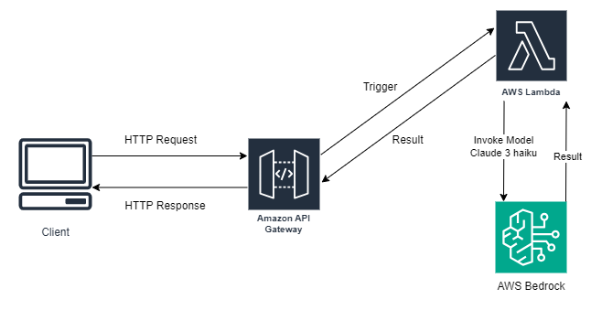

# 📄 QueriDoc

**QueriDoc** is an AI-powered document querying system built with Django and deployed serverlessly on AWS using [Zappa](https://github.com/zappa/Zappa). It allows users to upload a document and ask natural-language questions about its content. The responses are generated using Claude 3 Haiku through AWS Bedrock.

---

## 🌐 Live Demo

🔗 [https://k6svnek4j3.execute-api.eu-central-1.amazonaws.com/dev/home/](https://k6svnek4j3.execute-api.eu-central-1.amazonaws.com/dev/home/)

---

## 📑 Contents

- [Features](#features)
- [AWS Tools Used](#aws-tools-used)
- [Architecture of the Project](#architecture-of-the-project)
- [Installation Steps](#installation-steps)

---

## Features

- Upload a document and ask a question about its content.
- Responses are context-aware and grounded in the uploaded document.
- Built with Django, deployed using [Zappa](https://github.com/zappa/Zappa) to AWS Lambda.
- Uses Claude 3 Haiku via AWS Bedrock to generate accurate answers.
- Scalable, serverless architecture with real-time logging via CloudWatch.

---

## AWS Tools Used

- **AWS Lambda**: Runs the backend logic in a serverless environment.
- **Amazon API Gateway**: Routes user requests to the Lambda function.
- **AWS Bedrock**: Hosts Claude 3 Haiku, the model used to answer questions.
- **Amazon CloudWatch**: Used for logging and monitoring Lambda functions.

---

## Architecture of the Project

Below is the architecture diagram that shows how the system works:



1. The user submits a document and a question via the frontend.
2. **API Gateway** receives the request and triggers a **Lambda function**.
3. Lambda:
   - Extracts the document text,
   - Constructs a prompt using the user’s query,
   - Sends it to **Claude 3 Haiku** via **AWS Bedrock**.
4. The answer is returned through the API Gateway back to the user.

---

## Installation Steps

### 1. Clone the Repository

```bash
git clone https://github.com/your-username/queridoc.git
cd queridoc
```

### 2. Create and Activate a Virtual Environment
```bash
pip install pipenv
pipenv shell
```
### 3. Install Dependencies
```bash
pipenv install
```

### 4. Run the local server

```bash
cd src
python manage.py runserver
```

### 5. Navigate to the home page
`http://localhost:8000/home/`

If you want to use the local analyzer endpoint at `http://localhost:8000/api/analyzer/answer-query`, you must configure your [AWS credentials](https://docs.aws.amazon.com/cli/v1/userguide/cli-configure-files.html) to access AWS Bedrock.
